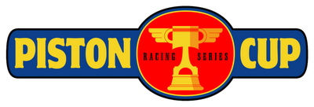
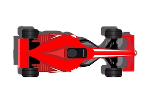
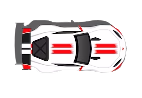
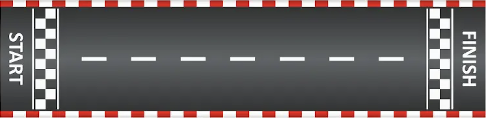

<!DOCTYPE html>
<html lang="en">
  <head>
    <meta charset="UTF-8" />
    <meta http-equiv="X-UA-Compatible" content="IE=edge" />
    <meta name="viewport" content="width=device-width, initial-scale=1.0" />
    <title>Course de Voitures</title>
    <link rel="stylesheet" href="course.css" />
    
  </head>
  <body>
    

    <h1>Course de Voitures - Piston Cup</h1>

    

      

        
      

      
00:00:00

      

        
      

      
00:00:00

      

      <button type="button" onClick="demarrerCourse()" id=" ">
        Démarrer la Course
      </button>
      
10

    

  </body>
</html>
